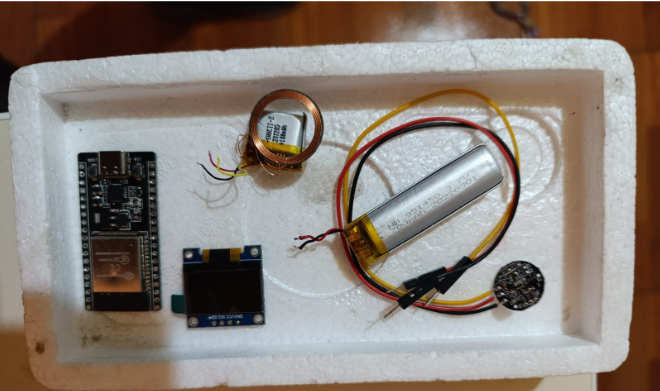
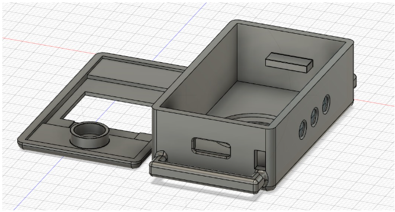
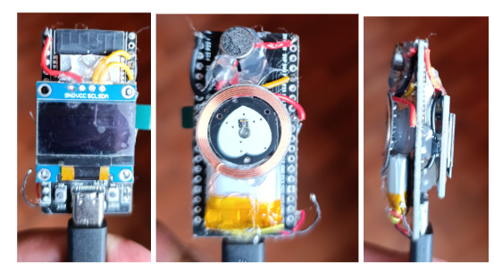
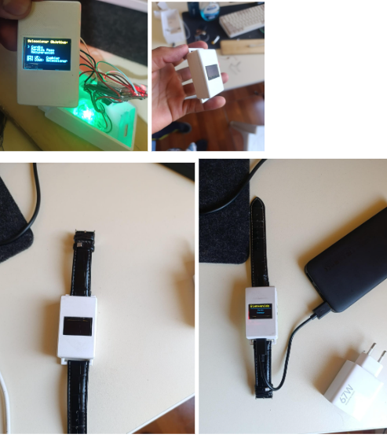

# NStrength — Pulsera Biométrica Inteligente para Fitness (Firmware ESP32)


**NStrength** es un prototipo de pulsera inteligente diseñada específicamente para deportistas y culturistas. El dispositivo utiliza sensores biométricos para optimizar la hipertrofia muscular gestionando los tiempos de descanso de forma dinámica, basándose en la recuperación cardíaca real del usuario en lugar de temporizadores fijos.

> **Nota:** Este repositorio sirve como **demostración técnica y portafolio** del desarrollo de hardware y firmware. Actualmente, el proyecto se encuentra en fase de prototipado privado y el código fuente completo no está disponible para clonación pública.

---

## ✨ Características

- **Monitoreo biométrico en tiempo real** mediante sensor de pulso cardíaco (lectura analógica de precisión).
- **Gestión inteligente de descansos:** el tiempo entre series se calcula según la recuperación cardíaca real, no con temporizadores fijos.
- **Interfaz de usuario en pantalla OLED** (SSD1306 por bus I2C).
- **Alertas hápticas** con motor de vibración para avisar el fin del descanso sin mirar la pantalla.
- **Autonomía portátil:** batería LiPo con módulo de carga TP4056 integrado.
- **Carcasa ergonómica** modelada en 3D e impresa a medida para uso en la muñeca.

---

## 📸 Galería del Prototipo

A continuación se detalla el proceso de construcción, desde la selección de componentes hasta el ensamblaje final.

### 1. Selección de componentes (hardware)
Microcontrolador ESP32, pantalla OLED, sensor de pulso cardíaco, batería LiPo y sistema de carga TP4056 integrados en un diseño compacto.


### 2. Diseño y carcasa
Modelado 3D personalizado para alojar la electrónica de forma ergonómica en la muñeca.


### 3. Integración y circuitería (V1)
Primeras pruebas de soldadura e integración del circuito de gestión de energía y sensores en el espacio reducido.


### 4. Prototipo funcional (V2)
Dispositivo ensamblado y funcional mostrando la interfaz de usuario en la pantalla OLED.


---

## 🛠 Tecnologías

| Área | Detalle |
|---|---|
| Microcontrolador | ESP32 (arquitectura Xtensa LX6) |
| Lenguaje de firmware | C++ optimizado para sistemas embebidos |
| Pantalla | OLED SSD1306 vía bus I2C |
| Sensor | Sensor de pulso cardíaco (lectura analógica) |
| Energía | Batería LiPo + módulo de carga TP4056 |
| Actuadores | Motor de vibración (alertas hápticas) |
| Manufactura | Diseño CAD e impresión 3D |

---

## 📦 Requisitos previos

Para compilar y cargar firmware de este tipo en un ESP32 se necesita:

- **Arduino IDE 2.x** (con el core de placas *esp32* de Espressif instalado) **o PlatformIO** sobre VS Code.
- **Drivers USB-serial** del conversor de tu placa (CP210x o CH340, según el modelo de ESP32).
- **Cable micro-USB de datos** y una placa de desarrollo ESP32.
- Librerías para los periféricos usados (por ejemplo, las de la pantalla OLED SSD1306 por I2C).
- Hardware del prototipo: sensor de pulso, pantalla OLED, motor de vibración, batería LiPo y módulo TP4056 (ver galería).

---

## 🚀 Instalación y ejecución

> El código fuente completo se mantiene privado; el directorio `NStrength-ESP32-Firmware/` contiene la parte publicada como demostración. El flujo estándar para compilar y flashear firmware ESP32 es el siguiente:

1. Clona el repositorio:
   ```bash
   git clone https://github.com/NinaDIV/NStrength-ESP32-Fitness-Firmware.git
   cd NStrength-ESP32-Fitness-Firmware
   ```
2. Abre la carpeta `NStrength-ESP32-Firmware/` en Arduino IDE o PlatformIO.
3. Instala el core de ESP32 y las librerías de los periféricos (OLED SSD1306, etc.).
4. Conecta la placa por USB y selecciona la tarjeta (**ESP32 Dev Module** o equivalente) y el puerto serie correcto.
5. Compila y sube el firmware (*Upload* / `pio run -t upload`).
6. Al arrancar, el dispositivo muestra la interfaz de usuario en la pantalla OLED y comienza la lectura del sensor de pulso (ver Prototipo V2 en la galería).

---

## 📁 Estructura del proyecto

```
NStrength-ESP32-Fitness-Firmware/
├── Galeria/                    # Fotos del proceso de construcción y prototipos
├── NStrength-ESP32-Firmware/   # Firmware del dispositivo (C++)
├── .gitattributes
└── README.md
```

---

## ⚠️ Estado del código y licencia

Este proyecto es propiedad intelectual del autor. Actualmente, **no se aceptan contribuciones externas ni clonaciones** para uso comercial.

- **Desarrollador:** Milward Fernando Nina Mayta
- **Contacto:** [linkedin.com/in/milward-nina](https://linkedin.com/in/milward-nina)

---
© 2024 NStrength Project. Todos los derechos reservados.
